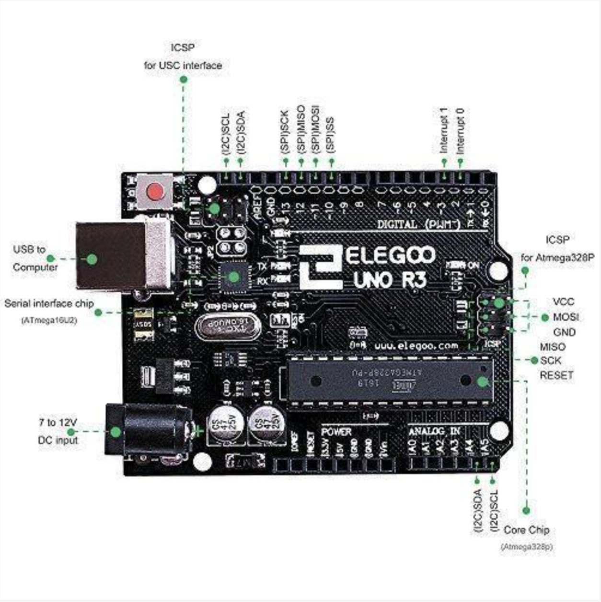

# **Basic LED Blink Setup with 220Ω Resistor for Initial Circuit Testing**

## **Project Overview**
This project demonstrates a simple **LED blink circuit** using an **Arduino Uno R3** and a **220Ω resistor** to ensure safe current flow through the LED. It was completed using **Arduino Cloud**, **Arduino Web Editor**, **Tinkercad**, and the **Elegoo Uno R3** kit for physical testing. This serves as an initial circuit test to verify proper component connections, circuit layout, and code execution.


*Side-by-side view of the LED blink circuit simulation in Tinkercad and physical setup with the Elegoo Uno R3 board.*

---

## **Hardware Components**
1. **Elegoo Uno R3** (Arduino-compatible, **ATmega328P** and **ATmega16U2** for USB communication)
2. **Breadboard**
3. **LED (Red)**
4. **220Ω Resistor** (Current Limiting Resistor)
5. **Connecting Wires**:
   - Black Wire (GND)
   - Green Wire (Signal to Pin 13)

---

## **Tools and Platforms Used**
- **Arduino Cloud & Arduino Web Editor**: For writing and uploading the blink sketch.
- **Tinkercad**: For simulating the circuit before building the physical setup.
- **Elegoo Uno R3**: Arduino-compatible board used for physical testing.
- **macOS with USB-C to USB-A Adapter**: For connecting the Arduino board to the computer.

---

**Elegoo Uno R3 Board**:


*Elegoo Uno R3 board based on the ATmega328P microcontroller. Learn more about it [here](https://www.elegoo.com/products/elegoo-uno-r3-board/).*

---

## **Circuit Setup**

1. **LED Connections**:
   - **Anode (long leg)**: Inserted into **E12** on the breadboard.
   - **Cathode (short leg)**: Shared with **E13** on the breadboard, connected to **GND** via a **black wire**.

2. **Resistor (220Ω)**:
   - One leg in **D12** (shared with the anode).
   - The other leg in **D1** on the breadboard.

3. **Green Signal Wire**:
   - Connect **D1** on the breadboard to **Digital Pin 13** on the Arduino to control the LED.

---

## **Code Explanation**
This is a basic **Blink** sketch that blinks an external LED connected to **pin 13** on the Elegoo Uno R3.

```cpp
// Filename: Blink_LED
/*
 * This code blinks an external LED connected to pin 13.
 */

#define LED_PIN 13             // Define LED pin
const int delay_time = 1000;   // Constant for delay time

void setup() {
    pinMode(LED_PIN, OUTPUT);  // Set pin 13 as output
}

void loop() {
    digitalWrite(LED_PIN, HIGH);   // Turn the LED on
    delay(delay_time);             // Wait for 1 second
    digitalWrite(LED_PIN, LOW);    // Turn the LED off
    delay(delay_time);             // Wait for 1 second
}
```

---

### **Why 220Ω Resistor?**

The 220Ω resistor limits the current flowing through the LED to prevent it from burning out. Using **Ohm’s Law**, we ensure the LED operates safely with the 5V supply from the Arduino:

$$
R = \frac{V_{supply} - V_{LED}}{I}
$$

Where:
- $V_{supply} = 5V$ (Arduino's output voltage)
- $V_{LED} = 2V$ (forward voltage drop across the LED)
- $I = 20mA$ (safe current for most LEDs)

$$
R = \frac{5V - 2V}{0.02A} = 150\Omega
$$

Although 150Ω is calculated, **220Ω** is commonly used to provide a safety margin, ensuring the current stays well within safe limits for the LED.

---

## **Best Practices: From Simulation to PCB**

When moving from a **simulation** (e.g., Tinkercad) to a **printed circuit board (PCB)**, it's essential to follow best practices:

- **Component Placement**: Optimize layout to minimize signal interference and power loss.
- **Connections**: Follow simulation wiring carefully, ensuring solid physical connections.
- **Testing**: Always prototype on a breadboard before committing to PCB design to avoid costly errors.

---

## **How to Use**
1. **Tinkercad**:
   - Build the circuit in **Tinkercad** and simulate the LED blink.
   - Upload the code using Tinkercad’s built-in code editor.

2. **Arduino Web Editor (Cloud)**:
   - Copy the provided code into a new sketch.
   - Connect your **Elegoo Uno R3** to **macOS** using a USB cable.
   - Upload the sketch and verify the LED blinks on the physical board.

---

## **Troubleshooting**
- **LED Not Blinking**:
  - Double-check the wiring, especially GND and pin 13 connections.
  - Ensure the resistor is in place to protect the LED.
  - Confirm that the code was successfully uploaded by checking the console for errors.

---
