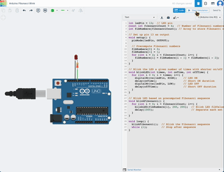

# Fibonacci Sequence: From Iterative Printing to LED Blinking

## Step 1: Fibonacci Sequence Printer

### Description:
This program computes and prints the first six Fibonacci numbers using an efficient iterative approach.

### Fibonacci Sequence:
The Fibonacci sequence is defined as:

$$
F(n) = F(n-1) + F(n-2)
$$

Where $F(0) = 0$ and $F(1) = 1$. The first 6 Fibonacci numbers are:

$$
0, 1, 1, 2, 3, 5
$$

### Prerequisites:
- GCC or Clang installed
- Terminal access
- VSCode or text editor

### Compilation:
1. Navigate to the project directory.
2. Compile using:

   ```bash
   mkdir -p bin && clang -o bin/fibonacci src/fibonacci/main.c
   ```

### Run:
To execute the Fibonacci printer:

```bash
./bin/fibonacci
```

### Output Example:
The output will display the sequence: `0 1 1 2 3 5`.

  
*Console output showing the first 6 Fibonacci numbers printed on the terminal.*

---

## Step 2: Fibonacci-Driven LED Blinking

### Description:
This program makes an LED blink on pin 13, with the number of blinks corresponding to Fibonacci numbers. Delays between sets of blinks are proportional to Fibonacci values.

### Grouping Fibonacci Blinks:
The LED blinks in groups. For each Fibonacci number $F(n)$, the LED blinks $F(n)$ times. For example, it blinks once for $F(1)$, then twice for $F(2)$, and so on. A longer pause separates the groups of blinks, clearly distinguishing each Fibonacci number in the sequence.

### Expected Blink Pattern:
The LED will blink as follows:  
- No blink for $F(0)$
- 1 blink for $F(1)$
- 1 blink for $F(2)$
- 2 blinks for $F(3)$
- 3 blinks for $F(4)$
- 5 blinks for $F(5)$

Each group of blinks is separated by a 1-second pause for clarity.

---

### Prerequisites:
- Arduino board (e.g., Elegoo UNO R3)
- Pin 13 for the LED
- Arduino IDE or VSCode with Arduino plugin

### Upload to Arduino:
1. Open the `.ino` file (located in `src/fibonacci/fibonacci_blink.ino`).
2. Upload it to the Arduino board.

---

  
*Demonstrating the LED blink pattern based on Fibonacci sequence. Each set of blinks corresponds to a Fibonacci number.*

---

## Code: Fibonacci Printer in C
```c
#include <stdio.h>

void printFibonacci(int n) {
    int a = 0, b = 1, next;
    printf("%d %d ", a, b);
    for (int i = 2; i < n; i++) {
        next = a + b;
        printf("%d ", next);
        a = b;
        b = next;
    }
    printf("\n");
}

int main() {
    printFibonacci(6);
    return 0;
}
```

## Code: Fibonacci-Driven LED Blink for Arduino
```cpp
int ledPin = 13;

void setup() {
  pinMode(ledPin, OUTPUT);
}

int fibonacci(int n) {
  if (n == 0) return 0;
  if (n == 1) return 1;
  int prev = 0, current = 1, next;
  for (int i = 2; i <= n; i++) {
    next = prev + current;
    prev = current;
    current = next;
  }
  return current;
}

void blinkFibonacci(int count) {
  for (int i = 0; i < count; i++) {
    int fibValue = fibonacci(i);   
    for (int j = 0; j < fibValue; j++) {
      digitalWrite(ledPin, HIGH);
      delay(200);
      digitalWrite(ledPin, LOW);
      delay(200);
    }
    delay(1000);  // Pause between Fibonacci blinks
  }
}

void loop() {
  blinkFibonacci(6);
  while (1);
}
```