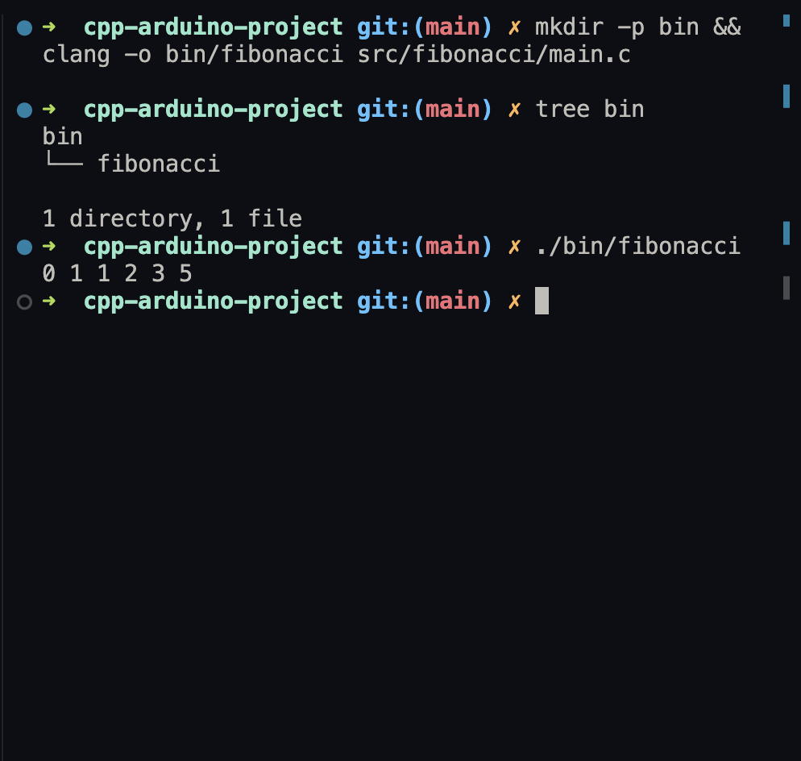

# Fibonacci Sequence Program

### Description:
This program computes and prints the first six Fibonacci numbers using an efficient algorithm.

### Fibonacci Sequence:
The Fibonacci sequence is defined as:

$$
F(n) = F(n-1) + F(n-2)
$$

where $F(0) = 0$ and $F(1) = 1$, and $n \in \mathbb{Z}^+$ ($n$ is a positive integer).

The first 6 numbers of the sequence are:

$$
0, 1, 1, 2, 3, 5
$$

### Prerequisites:
- Installed GCC or Clang
- Terminal/CLI
- VSCode or another text editor

### Compilation:
1. Ensure you are in the project root directory.
2. Compile with:

   ```bash
   mkdir -p bin && clang -o bin/fibonacci src/fibonacci/main.c
   ```

### Run:
Execute the program:

```bash
./bin/fibonacci
```

### Output:
When you run the program, you should see the following output:


*Console output showing the first 6 Fibonacci numbers*

This image demonstrates the successful execution of our Fibonacci sequence program, displaying the first 6 numbers of the sequence as calculated by our algorithm.